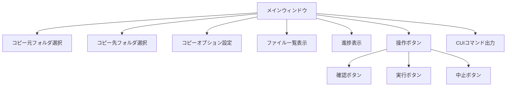
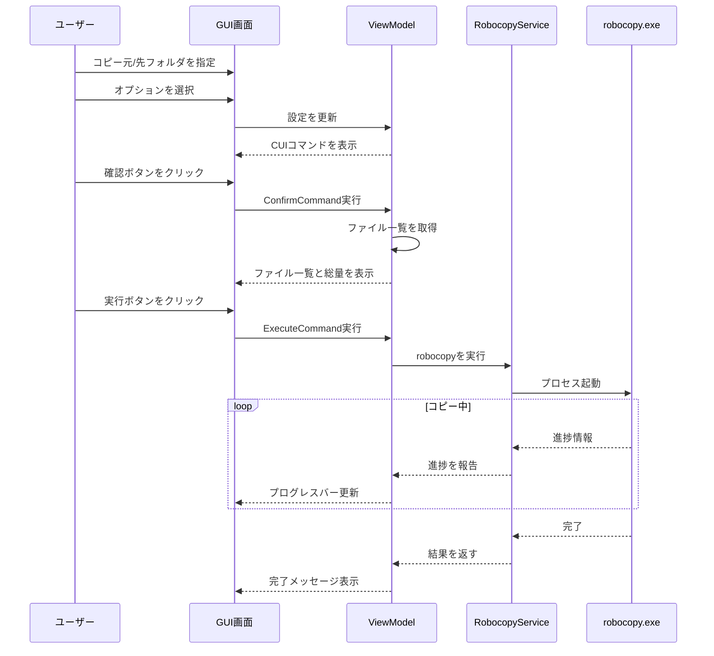

# Robocopy GUI ツール

Windows標準のrobocopyコマンドをGUIで操作するためのアプリケーションです。
C#版とVB.NET版の両方を提供しています。

## 機能

- **robocopyの実行**: GUIからrobocopyコマンドを簡単に実行
- **進捗表示**: コピー進捗をプログレスバーで表示
- **ファイル一覧化**: コピー対象ファイルの一覧と総量を表示
- **CUIコマンド生成**: 設定に基づいたrobocopyコマンドを自動生成

## 画面構成



## 処理フロー



## コピーオプション

| オプション | 説明 |
|-----------|------|
| サブフォルダもコピー (/E) | 空のサブディレクトリも含めてコピー |
| ミラーリング (/MIR) | ディレクトリツリーをミラーリング（削除も含む） |
| 再開可能モード (/Z) | ネットワーク障害時に再開可能なモードでコピー |
| 全ての属性をコピー (/COPYALL) | ファイルの全ての情報をコピー |
| リトライ回数(3回) (/R:3) | 失敗したコピーのリトライ回数 |
| 待機時間(10秒) (/W:10) | リトライ間の待機時間 |
| マルチスレッド(8) (/MT:8) | 8スレッドでマルチスレッドコピー |
| 古いファイルを除外 (/XO) | コピー先に存在する古いファイルを除外 |
| 変更ファイルを除外 (/XC) | 変更されたファイルを除外 |
| 新しいファイルを除外 (/XN) | 新しいファイルを除外 |
| 余分なファイル削除 (/PURGE) | コピー元に存在しないファイルを削除 |
| ログ出力 (/LOG:robocopy.log) | robocopy.logファイルにログを出力 |

## 技術仕様

- **フレームワーク**: .NET Framework 4.6.1
- **UI**: WPF (Windows Presentation Foundation)
- **アーキテクチャ**: MVVM (Model-View-ViewModel)
- **言語**: C# および VB.NET

## プロジェクト構成

```
├── RobocopyGUI.sln           # ソリューションファイル
└── src/
    ├── RobocopyGUI.CSharp/   # C#版プロジェクト
    │   ├── App.xaml          # アプリケーション定義
    │   ├── MainWindow.xaml   # メインウィンドウUI
    │   ├── ViewModels/       # ViewModelクラス
    │   ├── Models/           # モデルクラス
    │   └── Services/         # サービスクラス
    └── RobocopyGUI.VB/       # VB.NET版プロジェクト
        ├── Application.xaml  # アプリケーション定義
        ├── MainWindow.xaml   # メインウィンドウUI
        ├── ViewModels/       # ViewModelクラス
        ├── Models/           # モデルクラス
        └── Services/         # サービスクラス
```

## ビルド方法

### 前提条件

- Visual Studio 2019 以降
- .NET Framework 4.6.1 開発ツール

### ビルド手順

1. Visual Studioで `RobocopyGUI.sln` を開く
2. ソリューションをビルド（Ctrl+Shift+B）
3. 出力先に実行ファイルが生成される

または、コマンドラインから:

```bash
msbuild RobocopyGUI.sln /p:Configuration=Release
```

## 使用方法

1. アプリケーションを起動
2. 「参照...」ボタンでコピー元とコピー先フォルダを選択
3. 必要なコピーオプションにチェック
4. 「確認」ボタンでコピー対象ファイルを一覧表示
5. 内容を確認後、「実行」ボタンでコピー開始
6. コピー中は「中止」ボタンでキャンセル可能

## 注意事項

- robocopyはWindows標準コマンドのため、Windowsでのみ動作
- 管理者権限が必要な場合があります（アクセス権限のコピー時など）
- `/MIR`オプション使用時は、コピー先の既存ファイルが削除される可能性があります

## ライセンス

MIT License
