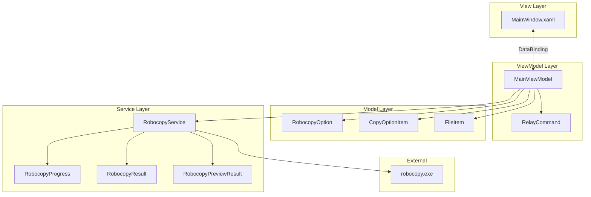

# Robocopy GUI ドキュメント

Robocopy GUIアプリケーションの設計ドキュメントです。

## ドキュメント一覧

| ドキュメント | 説明 |
|-------------|------|
| [クラス図](class-diagram.md) | アプリケーションのクラス構造とMVVMパターン |
| [シーケンス図](sequence-diagram.md) | 各機能の処理フロー |
| [アクティビティ図](activity-diagram.md) | 処理の流れと分岐 |
| [ユースケース図](usecase-diagram.md) | システムの機能と利用シナリオ |

## アーキテクチャ概要



## 確認処理について

確認処理では、robocopyの`/L`オプション（リスト表示のみ）を使用してプレビュー実行を行います。
これにより、コピーオプション（`/XO`での古いファイル除外など）を反映した、実際にコピーされるファイルの一覧を正確に取得できます。

### 主な特徴

- コピー元・コピー先の両方が設定されている場合のみ確認ボタンが有効
- 選択されたコピーオプションを反映した正確なファイル一覧を表示
- 各ファイルのコピー理由（新規/更新/変更など）を表示

## 技術スタック

- **フレームワーク**: .NET Framework 4.6.1
- **UI**: WPF (Windows Presentation Foundation)
- **アーキテクチャパターン**: MVVM (Model-View-ViewModel)
- **言語**: C#, VB.NET

## ディレクトリ構成

```
src/
├── RobocopyGUI.CSharp/          # C#版プロジェクト
│   ├── App.xaml                 # アプリケーション定義
│   ├── MainWindow.xaml          # メインウィンドウUI
│   ├── ViewModels/              # ViewModelクラス
│   │   ├── MainViewModel.cs     # メインViewModel
│   │   └── RelayCommand.cs      # ICommand実装
│   ├── Models/                  # モデルクラス
│   │   ├── RobocopyOption.cs    # オプション設定
│   │   ├── CopyOptionItem.cs    # UI用オプションアイテム
│   │   └── FileItem.cs          # ファイル情報
│   └── Services/                # サービスクラス
│       └── RobocopyService.cs   # robocopy実行サービス
└── RobocopyGUI.VB/              # VB.NET版プロジェクト
    └── (同構成)
```
