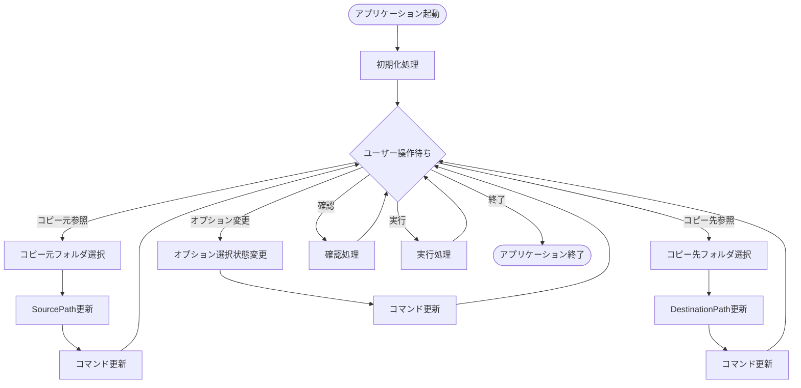
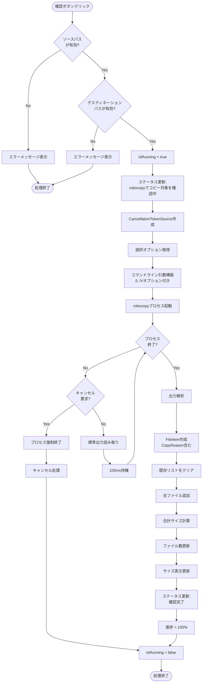
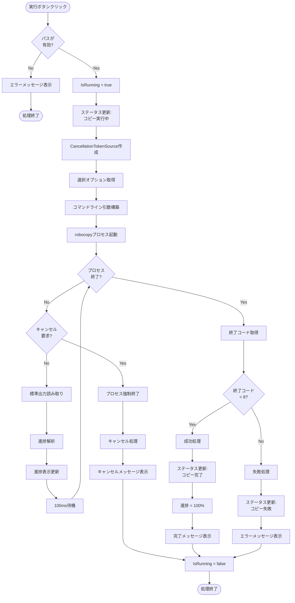
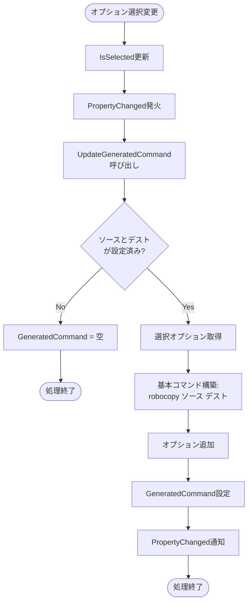
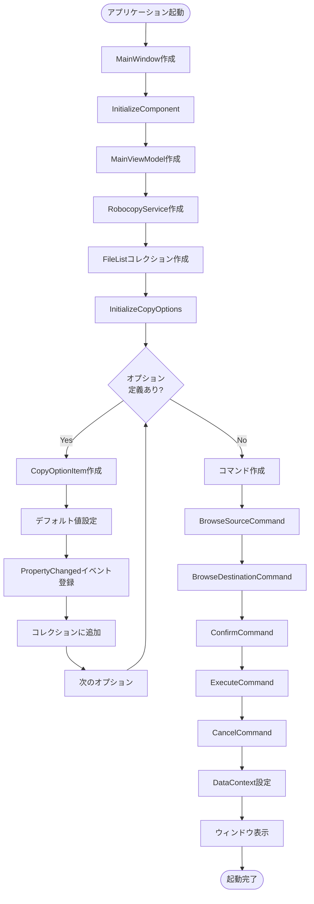

[← ホームに戻る](index.md)

# アクティビティ図

Robocopy GUIアプリケーションの処理フローを示します。

## メイン処理フロー

アプリケーション全体の処理フローです。

## 確認処理フロー

robocopyの`/L`オプションを使用したプレビュー実行の詳細フローです。
コピーオプションを反映した、実際にコピーされるファイルの一覧を取得します。

## 実行処理フロー

robocopy実行の詳細フローです。

## オプション設定フロー

オプション選択からコマンド生成までのフローです。

## 初期化フロー

アプリケーション起動時の初期化フローです。

