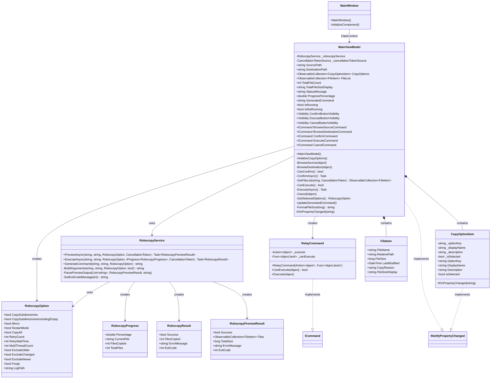
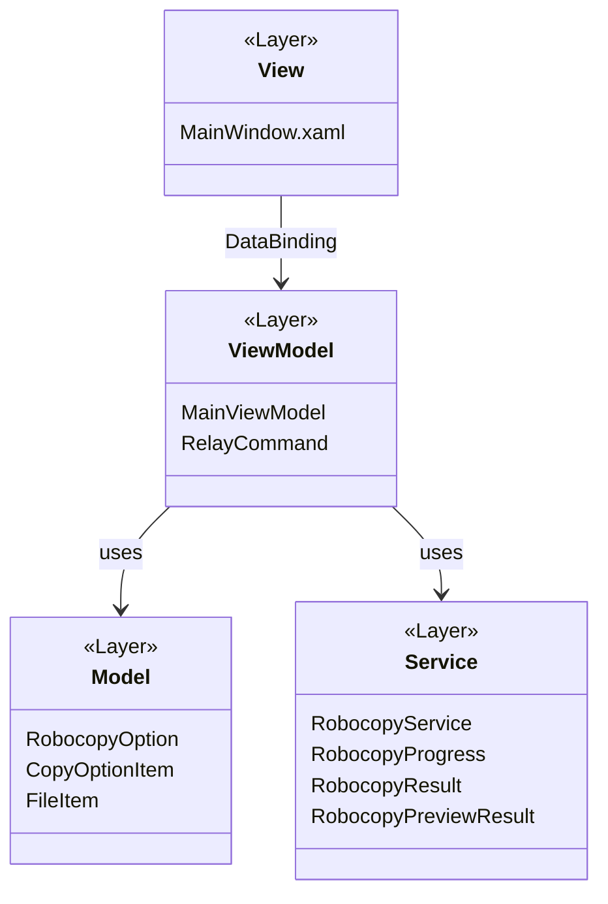
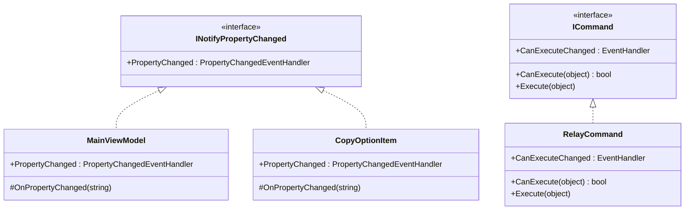

# クラス図

Robocopy GUIアプリケーションのクラス構造を示します。

## 全体クラス図

```mermaid
classDiagram
    class MainWindow {
        +MainWindow()
        -InitializeComponent()
    }
    
    class MainViewModel {
        -RobocopyService _robocopyService
        -CancellationTokenSource _cancellationTokenSource
        +string SourcePath
        +string DestinationPath
        +ObservableCollection~CopyOptionItem~ CopyOptions
        +ObservableCollection~FileItem~ FileList
        +int TotalFileCount
        +string TotalFileSizeDisplay
        +string StatusMessage
        +double ProgressPercentage
        +string GeneratedCommand
        +bool IsRunning
        +bool IsNotRunning
        +Visibility ConfirmButtonVisibility
        +Visibility ExecuteButtonVisibility
        +Visibility CancelButtonVisibility
        +ICommand BrowseSourceCommand
        +ICommand BrowseDestinationCommand
        +ICommand ConfirmCommand
        +ICommand ExecuteCommand
        +ICommand CancelCommand
        +MainViewModel()
        -InitializeCopyOptions()
        -BrowseSource(object)
        -BrowseDestination(object)
        -CanConfirm() bool
        -ConfirmAsync() Task
        -GetFileList(string, CancellationToken) ObservableCollection~FileItem~
        -CanExecute() bool
        -ExecuteAsync() Task
        -Cancel(object)
        -GetSelectedOptions() RobocopyOption
        -UpdateGeneratedCommand()
        -FormatFileSize(long) string
        #OnPropertyChanged(string)
    }
    
    class RelayCommand {
        -Action~object~ _execute
        -Func~object,bool~ _canExecute
        +RelayCommand(Action~object~, Func~object,bool~)
        +CanExecute(object) bool
        +Execute(object)
    }
    
    class RobocopyService {
        +PreviewAsync(string, string, RobocopyOption, CancellationToken) Task~RobocopyPreviewResult~
        +ExecuteAsync(string, string, RobocopyOption, IProgress~RobocopyProgress~, CancellationToken) Task~RobocopyResult~
        +GenerateCommand(string, string, RobocopyOption) string
        -BuildArguments(string, string, RobocopyOption, bool) string
        -ParsePreviewOutput(List~string~, RobocopyPreviewResult, string)
        -GetExitCodeMessage(int) string
    }
    
    class RobocopyOption {
        +bool CopySubdirectories
        +bool CopySubdirectoriesIncludingEmpty
        +bool Mirror
        +bool RestartMode
        +bool CopyAll
        +int RetryCount
        +int RetryWaitTime
        +int MultiThreadCount
        +bool ExcludeOlder
        +bool ExcludeChanged
        +bool ExcludeNewer
        +bool Purge
        +string LogPath
    }
    
    class CopyOptionItem {
        -string _optionKey
        -string _displayName
        -string _description
        -bool _isSelected
        +string OptionKey
        +string DisplayName
        +string Description
        +bool IsSelected
        #OnPropertyChanged(string)
    }
    
    class FileItem {
        +string FileName
        +string RelativePath
        +long FileSize
        +DateTime LastModified
        +string CopyReason
        +string FileSizeDisplay
    }
    
    class RobocopyProgress {
        +double Percentage
        +string CurrentFile
        +int FilesCopied
        +int TotalFiles
    }
    
    class RobocopyResult {
        +bool Success
        +int FilesCopied
        +string ErrorMessage
        +int ExitCode
    }
    
    class RobocopyPreviewResult {
        +bool Success
        +ObservableCollection~FileItem~ Files
        +long TotalSize
        +string ErrorMessage
        +int ExitCode
    }
    
    MainWindow --> MainViewModel : DataContext
    MainViewModel --> RobocopyService : uses
    MainViewModel --> RelayCommand : creates
    MainViewModel *-- CopyOptionItem : contains
    MainViewModel *-- FileItem : contains
    MainViewModel --> RobocopyOption : creates
    RobocopyService --> RobocopyOption : uses
    RobocopyService --> RobocopyProgress : creates
    RobocopyService --> RobocopyResult : creates
    RobocopyService --> RobocopyPreviewResult : creates
    
    MainViewModel ..|> INotifyPropertyChanged : implements
    CopyOptionItem ..|> INotifyPropertyChanged : implements
    RelayCommand ..|> ICommand : implements
```

## MVVMパターン構造

```mermaid
classDiagram
    direction TB
    
    class View {
        <<Layer>>
        MainWindow.xaml
    }
    
    class ViewModel {
        <<Layer>>
        MainViewModel
        RelayCommand
    }
    
    class Model {
        <<Layer>>
        RobocopyOption
        CopyOptionItem
        FileItem
    }
    
    class Service {
        <<Layer>>
        RobocopyService
        RobocopyProgress
        RobocopyResult
        RobocopyPreviewResult
    }
    
    View --> ViewModel : DataBinding
    ViewModel --> Model : uses
    ViewModel --> Service : uses
```

## インターフェース実装

```mermaid
classDiagram
    class INotifyPropertyChanged {
        <<interface>>
        +PropertyChanged : PropertyChangedEventHandler
    }
    
    class ICommand {
        <<interface>>
        +CanExecuteChanged : EventHandler
        +CanExecute(object) bool
        +Execute(object)
    }
    
    class MainViewModel {
        +PropertyChanged : PropertyChangedEventHandler
        #OnPropertyChanged(string)
    }
    
    class CopyOptionItem {
        +PropertyChanged : PropertyChangedEventHandler
        #OnPropertyChanged(string)
    }
    
    class RelayCommand {
        +CanExecuteChanged : EventHandler
        +CanExecute(object) bool
        +Execute(object)
    }
    
    INotifyPropertyChanged <|.. MainViewModel
    INotifyPropertyChanged <|.. CopyOptionItem
    ICommand <|.. RelayCommand
```
