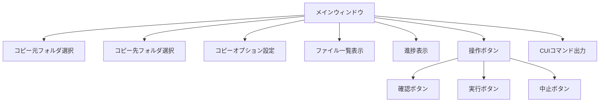

# Robocopy GUI ツール

Windows標準のrobocopyコマンドをGUIで操作するためのアプリケーションです。  
C#版とVB.NET版の両方を提供しています。

## ダウンロード

最新バージョンは以下からダウンロードできます：

  <a href="https://github.com/hn770123/GUI-robocopy/releases/latest" class="btn">📦 最新リリースをダウンロード</a>

### 利用可能なバージョン

| バージョン | 説明 |
|-----------|------|
| **C#版** | C#で実装されたバージョン |
| **VB.NET版** | VB.NETで実装されたバージョン |

> **動作要件**: Windows 10/11, .NET Framework 4.6.1 以降

## 機能

- **robocopyの実行**: GUIからrobocopyコマンドを簡単に実行
- **進捗表示**: コピー進捗をプログレスバーで表示
- **ファイル一覧化**: コピー対象ファイルの一覧と総量を表示
- **CUIコマンド生成**: 設定に基づいたrobocopyコマンドを自動生成

## 画面構成

## 使用方法

1. アプリケーションを起動
2. 「参照...」ボタンでコピー元とコピー先フォルダを選択
3. 必要なコピーオプションにチェック
4. 「確認」ボタンでコピー対象ファイルを一覧表示
5. 内容を確認後、「実行」ボタンでコピー開始
6. コピー中は「中止」ボタンでキャンセル可能

## ドキュメント

| ドキュメント | 説明 |
|-------------|------|
| [クラス図](class-diagram.md) | アプリケーションのクラス構造とMVVMパターン |
| [シーケンス図](sequence-diagram.md) | 各機能の処理フロー |
| [アクティビティ図](activity-diagram.md) | 処理の流れと分岐 |
| [ユースケース図](usecase-diagram.md) | システムの機能と利用シナリオ |

## コピーオプション

| オプション | 説明 |
|-----------|------|
| サブフォルダもコピー (/E) | 空のサブディレクトリも含めてコピー |
| ミラーリング (/MIR) | ディレクトリツリーをミラーリング（削除も含む） |
| 再開可能モード (/Z) | ネットワーク障害時に再開可能なモードでコピー |
| 全ての属性をコピー (/COPYALL) | ファイルの全ての情報をコピー |
| リトライ回数(3回) (/R:3) | 失敗したコピーのリトライ回数 |
| 待機時間(10秒) (/W:10) | リトライ間の待機時間 |
| マルチスレッド(8) (/MT:8) | 8スレッドでマルチスレッドコピー |
| 古いファイルを除外 (/XO) | コピー先に存在する古いファイルを除外 |
| 変更ファイルを除外 (/XC) | 変更されたファイルを除外 |
| 新しいファイルを除外 (/XN) | 新しいファイルを除外 |
| 余分なファイル削除 (/PURGE) | コピー元に存在しないファイルを削除 |
| ログ出力 (/LOG:robocopy.log) | robocopy.logファイルにログを出力 |

## 注意事項

- robocopyはWindows標準コマンドのため、Windowsでのみ動作
- 管理者権限が必要な場合があります（アクセス権限のコピー時など）
- `/MIR`オプション使用時は、コピー先の既存ファイルが削除される可能性があります

## ソースコード

<a href="https://github.com/hn770123/GUI-robocopy" class="btn">GitHub リポジトリを見る</a>

## ライセンス

MIT License
