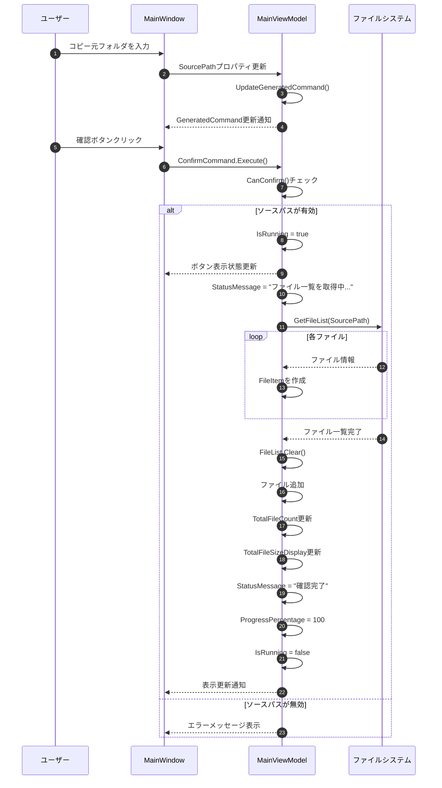
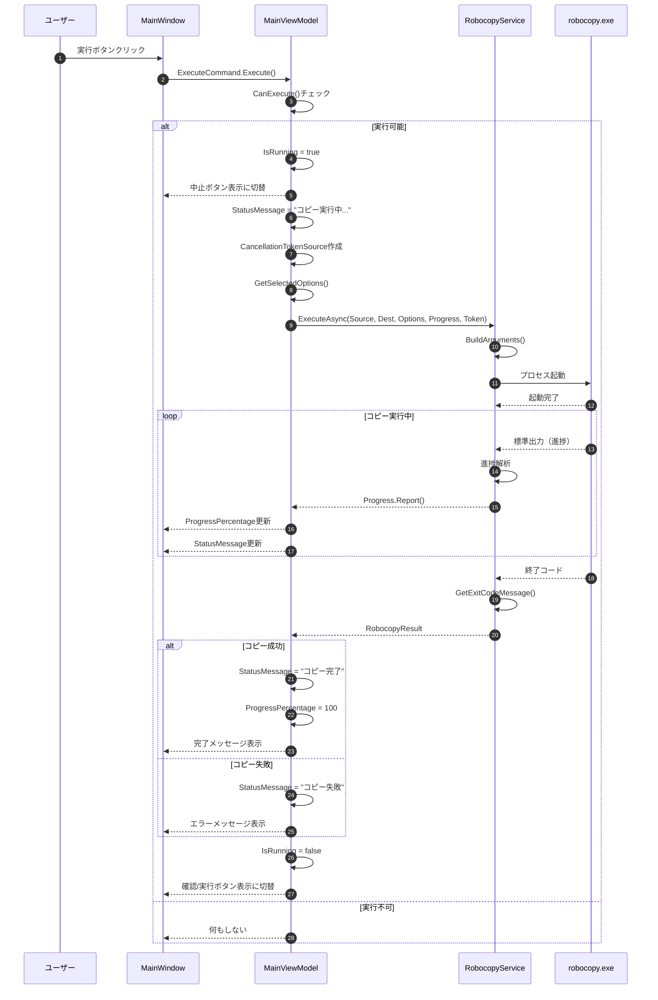
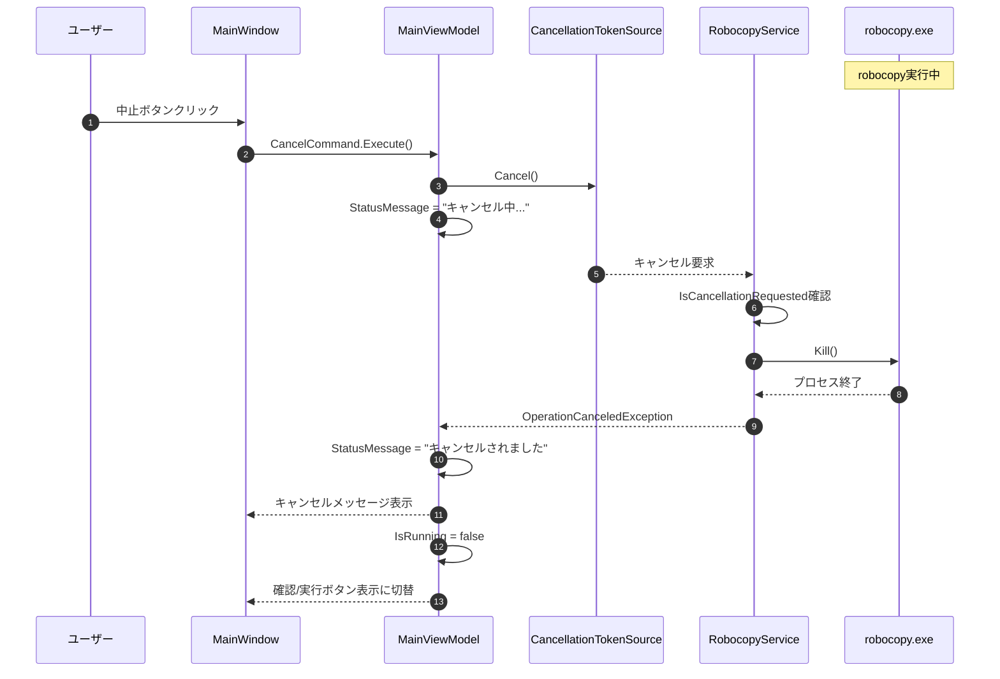
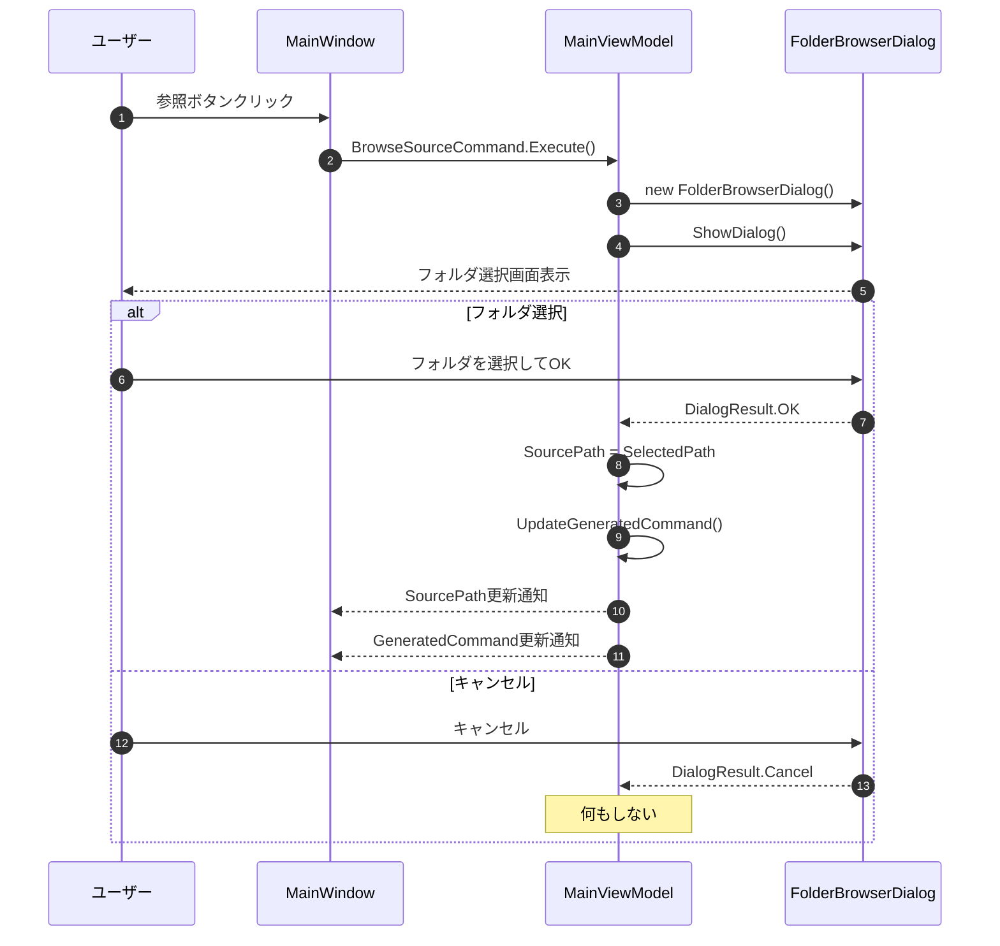
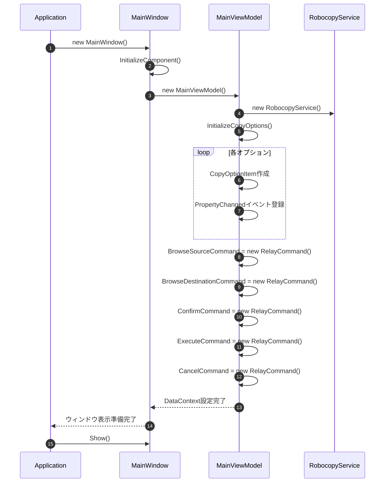

# シーケンス図

Robocopy GUIアプリケーションの主要な処理フローを示します。

## ファイル確認処理

ユーザーがコピー元フォルダを選択して確認ボタンをクリックした時の処理フローです。

## robocopy実行処理

ユーザーが実行ボタンをクリックした時のコピー処理フローです。

## キャンセル処理

ユーザーが中止ボタンをクリックした時の処理フローです。

## フォルダ参照処理

フォルダ選択ダイアログの表示フローです。

## アプリケーション起動処理

アプリケーション起動時の初期化フローです。

