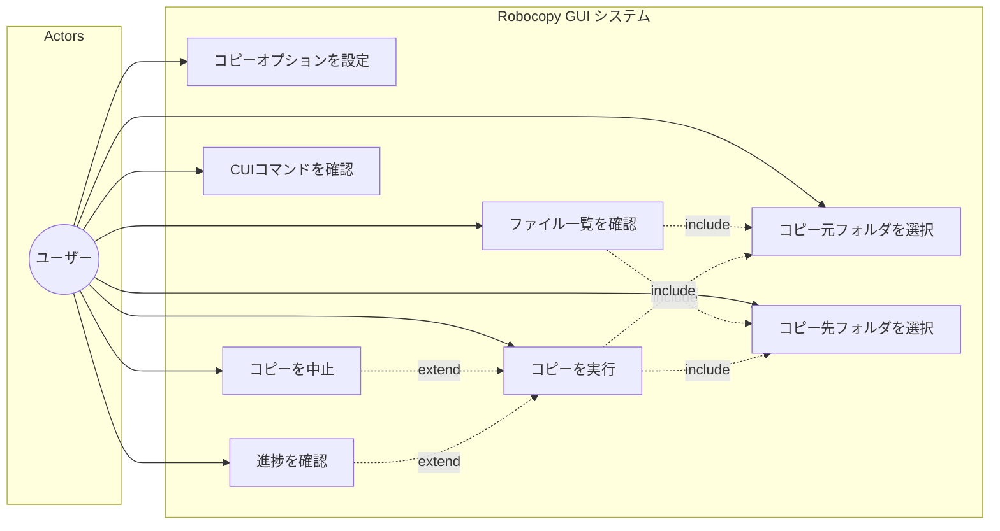
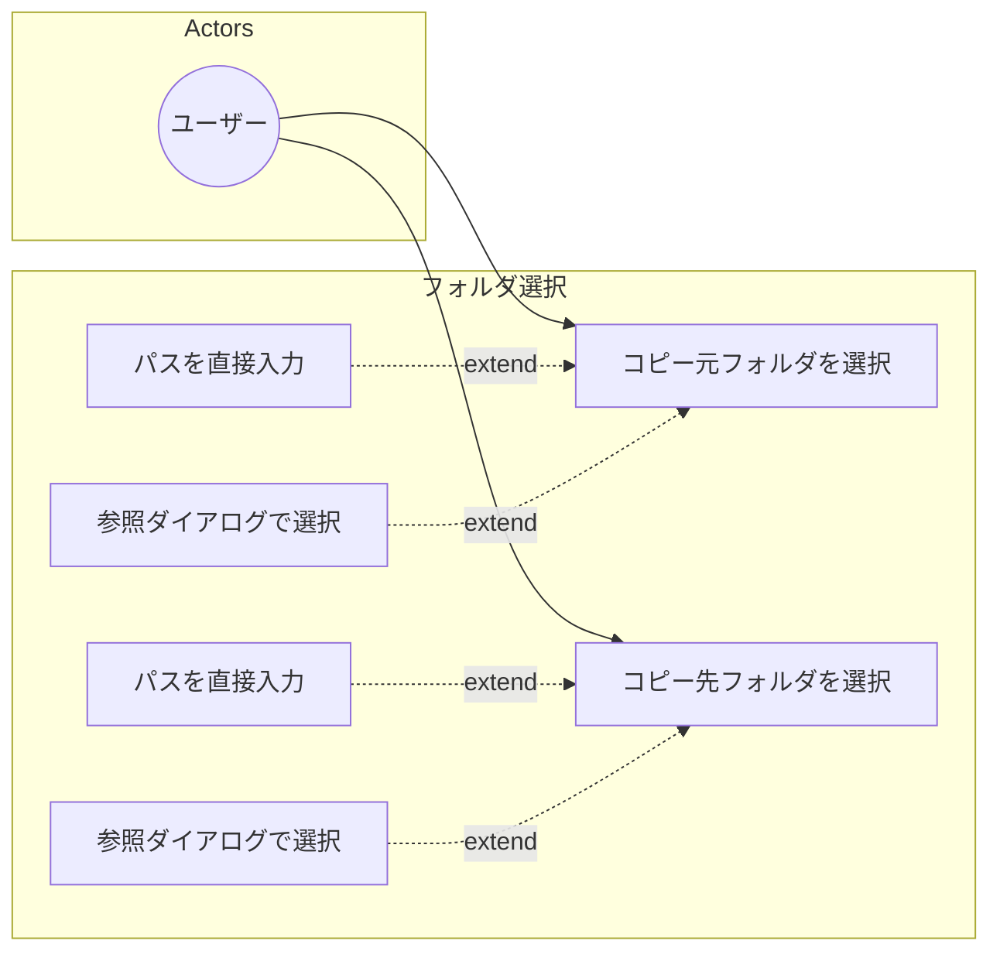
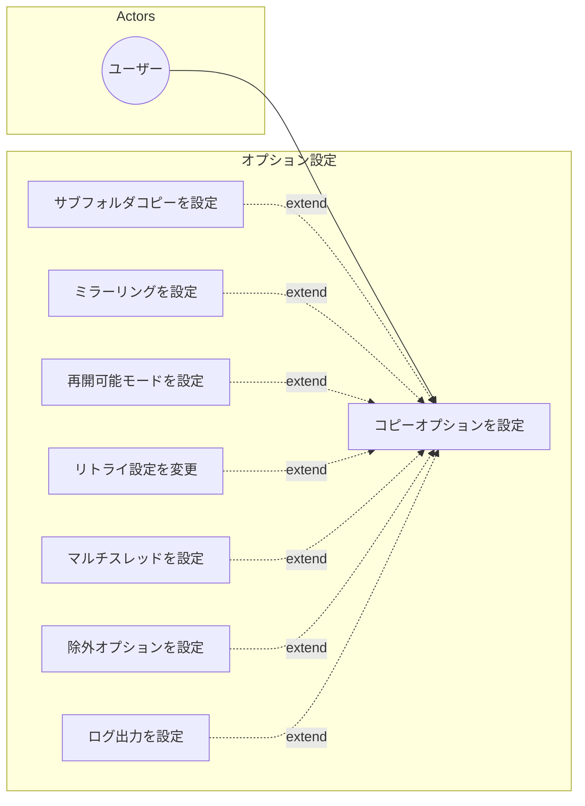
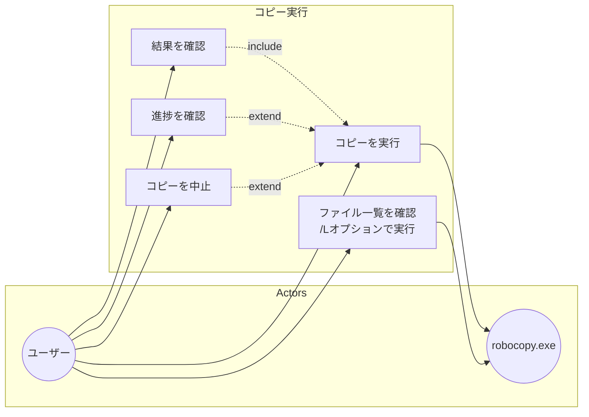

# ユースケース図

Robocopy GUIアプリケーションのユースケースを示します。

## 全体ユースケース図

## 詳細ユースケース図

### フォルダ選択関連

### オプション設定関連

### コピー実行関連

## ユースケース詳細

### UC01: コピー元フォルダを選択

| 項目 | 内容 |
|------|------|
| ID | UC01 |
| 名称 | コピー元フォルダを選択 |
| アクター | ユーザー |
| 事前条件 | アプリケーションが起動している |
| 事後条件 | コピー元パスが設定される |
| 基本フロー | 1. ユーザーが「参照...」ボタンをクリック 2. フォルダ選択ダイアログが表示される 3. ユーザーがフォルダを選択してOKをクリック 4. 選択したパスがテキストボックスに表示される 5. CUIコマンドが自動更新される |
| 代替フロー | 3a. ユーザーがキャンセルをクリック → 変更なし |

### UC02: コピー先フォルダを選択

| 項目 | 内容 |
|------|------|
| ID | UC02 |
| 名称 | コピー先フォルダを選択 |
| アクター | ユーザー |
| 事前条件 | アプリケーションが起動している |
| 事後条件 | コピー先パスが設定される |
| 基本フロー | 1. ユーザーが「参照...」ボタンをクリック 2. フォルダ選択ダイアログが表示される 3. ユーザーがフォルダを選択してOKをクリック 4. 選択したパスがテキストボックスに表示される 5. CUIコマンドが自動更新される |
| 代替フロー | 3a. ユーザーがキャンセルをクリック → 変更なし |

### UC03: コピーオプションを設定

| 項目 | 内容 |
|------|------|
| ID | UC03 |
| 名称 | コピーオプションを設定 |
| アクター | ユーザー |
| 事前条件 | アプリケーションが起動している |
| 事後条件 | 選択したオプションが有効になる |
| 基本フロー | 1. ユーザーがオプションのチェックボックスをクリック 2. オプションの選択状態が変更される 3. CUIコマンドが自動更新される |

### UC04: ファイル一覧を確認

| 項目 | 内容 |
|------|------|
| ID | UC04 |
| 名称 | ファイル一覧を確認 |
| アクター | ユーザー、robocopy.exe |
| 事前条件 | コピー元フォルダとコピー先フォルダが設定されている |
| 事後条件 | 実際にコピーされるファイルの一覧が表示される |
| 基本フロー | 1. ユーザーが「確認」ボタンをクリック 2. robocopyが`/L`オプション（リスト表示のみ）で実行される 3. ステータスが「robocopyでコピー対象を確認中...」に変更 4. コピーオプションを反映したファイル一覧がDataGridに表示される 5. 各ファイルにコピー理由（新規/更新/変更など）が表示される 6. ファイル数と合計サイズが表示される 7. ステータスが「確認完了」に変更 |
| 代替フロー | 2a. コピー元が存在しない → エラーメッセージ表示 2b. コピー先が未設定 → エラーメッセージ表示 |
| 備考 | コピーオプション（`/XO`での古いファイル除外など）を反映した正確なファイル一覧が取得される |

### UC05: コピーを実行

| 項目 | 内容 |
|------|------|
| ID | UC05 |
| 名称 | コピーを実行 |
| アクター | ユーザー、robocopy.exe |
| 事前条件 | コピー元・コピー先フォルダが設定されている |
| 事後条件 | ファイルがコピーされる |
| 基本フロー | 1. ユーザーが「実行」ボタンをクリック 2. 確認/実行ボタンが中止ボタンに切り替わる 3. robocopyプロセスが起動される 4. 進捗がプログレスバーに表示される 5. コピー完了後、完了メッセージが表示される 6. 中止ボタンが確認/実行ボタンに戻る |
| 代替フロー | 5a. エラー発生 → エラーメッセージ表示 |

### UC06: コピーを中止

| 項目 | 内容 |
|------|------|
| ID | UC06 |
| 名称 | コピーを中止 |
| アクター | ユーザー |
| 事前条件 | コピーが実行中である |
| 事後条件 | コピーが中止される |
| 基本フロー | 1. ユーザーが「中止」ボタンをクリック 2. キャンセル処理が開始される 3. robocopyプロセスが強制終了される 4. キャンセルメッセージが表示される 5. 中止ボタンが確認/実行ボタンに戻る |

### UC07: CUIコマンドを確認

| 項目 | 内容 |
|------|------|
| ID | UC07 |
| 名称 | CUIコマンドを確認 |
| アクター | ユーザー |
| 事前条件 | コピー元・コピー先が設定されている |
| 事後条件 | なし（表示のみ） |
| 基本フロー | 1. ユーザーがCUIコマンド出力欄を確認 2. 生成されたrobocopyコマンドが表示されている |

### UC08: 進捗を確認

| 項目 | 内容 |
|------|------|
| ID | UC08 |
| 名称 | 進捗を確認 |
| アクター | ユーザー |
| 事前条件 | コピーが実行中である |
| 事後条件 | なし（表示のみ） |
| 基本フロー | 1. プログレスバーで進捗率を確認 2. ステータスメッセージで現在のファイルを確認 |
